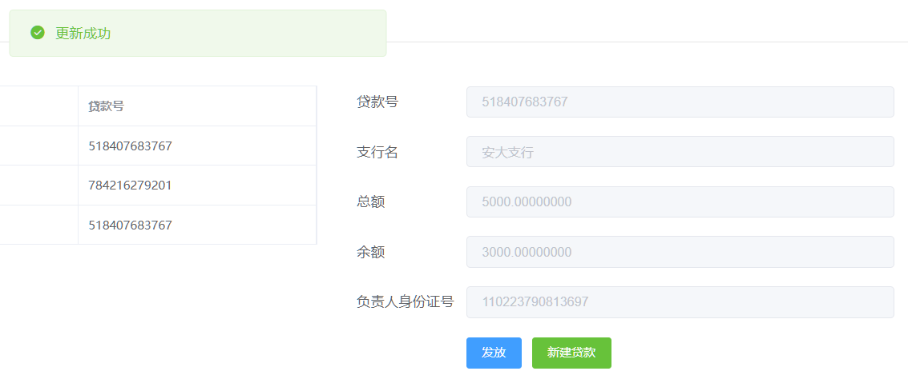
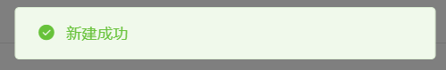
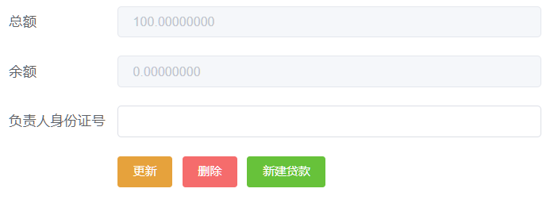

# 数据库lab3报告

**PB19071505 卢天祥**

## 框架

使用B/S架构，前后端分离

后端使用Django REST framework，其通过ORM模型与数据库交互，定义的类对应于数据库中的表，变量对应域，一个实例对应表中一条记录，这样使用model类提供的接口就可以用Python语言完成数据库操作

后端通过Serializer将数据序列化，对前端提供api，前端访问如`http://xxx:8000/api/client`的网址就可以操纵数据库

前端使用vue，响应式设计与组件化让写前端更方便；UI使用Element Plus库，简便的UI设计可以让更多精力专注于应用功能；通过axios完成前后端数据交互

## 后端

后端的主要工作在于`models.py, serializers.py, views.py`这三个文件

### models.py

在该文件定义了模型，根据lab2中的设计，使用Django的规范来写

如部门模型，其继承自`django.db.models.Model`，主键为`id`，`branch_name`为外键，引用`Branch`的`name`域

```python
from django.db import models

class Department(models.Model):  # 部门
    id = models.CharField(max_length=VARCHARMAX, primary_key=True)
    branch_name = models.ForeignKey('Branch', to_field='name', on_delete=models.RESTRICT)
    name = models.CharField(max_length=VARCHARMAX, null=True, blank=True)
    type = models.CharField(max_length=VARCHARMAX, null=True, blank=True)
```

### serializers.py

该文件定义了每个模型的`serializer`，还可以定义模型的合法性检查

只需继承自`rest_framework.serialezers.ModelSerializer`，然后设置几个重要的属性就可以得到模型的序列化器

如客户的序列化器，在子类`Meta`中指明是`Client`模型的序列化器，而且是序列化所有域

另外定义了额外的域`url`，指向客户详细信息的地址

```python
from rest_framework import serializers

class ClientSerializer(serializers.ModelSerializer):
    url_field_name = 'id'
    url = serializers.HyperlinkedIdentityField(view_name='api:client-detail', lookup_field='id', read_only=True)

    class Meta:
        model = Client
        fields = '__all__'

    def validate_id(self, client_id):
        # 检查客户身份证号是否合法，若不合法raise serializers.ValidationError，若合法则返回合法身份证号
        return client_id
```

### views.py

该文件是后端的主要工作，具体定义了每一个接口，以及接口的功能

对于每个模型都建立了ViewSet，它默认提供了增、删、查、改的功能，可以重写这些方法，还可以自定义操作

比如`LoanViewSet`视图集，继承自`rest_framework.viewsets.ModelViewSet`，使用`LoanSerializer`作为序列化器，查询所用的域是`id`

在这个视图集上自定义了操作`create_loan`，并定义为一个事务，接受`post`方法，前端将创建贷款所需的总金额、支行名、员工负责人身份证号、发放客户列表通过`post`中的`data`传递给后端，该方法检查并尝试创建贷款

```python
from rest_framework import viewsets
from .serializers import *
from rest_framework.decorators import action
from django.db import transaction

class LoanViewSet(viewsets.ModelViewSet):
    queryset = Loan.objects.all()
    serializer_class = LoanSerializer
    permission_classes = [IsAdminUser]
    lookup_field = 'id'

    @action(detail=False, methods=['post'])
    @transaction.atomic
    def create_loan(self, request):
        # 根据request中的数据创建贷款，发现错误rollback并返回错误信息，创建成功commit再发送状态为HTTP_200_OK的Response
        pass
```

对创建贷款中的各种错误该方法都返回了错误信息

```python
return Response(status=status.HTTP_400_BAD_REQUEST, data='贷款总额需大于0')
return Response(status=status.HTTP_400_BAD_REQUEST, data='贷款人数需大于0')
return Response(status=status.HTTP_400_BAD_REQUEST, data=f'支行名错误')  # 查询支行名发现不存在
return Response(status=status.HTTP_400_BAD_REQUEST, data=f'客户{client["id"]}不存在')  # 查询客户发现不存在
return Response(status=status.HTTP_400_BAD_REQUEST, data=f'员工{staff_id}不存在')  # 查询员工发现不存在
return Response(status=status.HTTP_400_BAD_REQUEST, data=f'新建贷款失败，请重试')  # 贷款号是随机数次，可能都重复
```

若成功则返回

```python
return Response(status=status.HTTP_201_CREATED)
```

在创建贷款的过程中涉及了多个表的更改，在`LoanViewSet`中创建该方法只是会生成特定的url，`http://xxx:8000/api/loan/create_loan`

对于查询操作，可以通过复写`get_queryset`实现自定义查询，如客户的查询使用了多个字段的与查询

```python
class ClientViewSet(viewsets.ModelViewSet):
    queryset = Client.objects.all()
    serializer_class = ClientSerializer
    permission_classes = [IsAdminUser]
    lookup_field = 'id'

    def get_queryset(self):
        text_fields = ['id', 'name', 'phone_number', 'address', 'contact_name', 'contact_phone_number',
                       'contact_email', 'contact_relationship']
        queryset = self.queryset
        for text_field in text_fields:  # 与查询, 更复杂的查询可以通过django.db.models.Q实现
            query_param = self.request.query_params.get(text_field)
            if query_param:
                queryset = queryset.filter(**{f'{text_field}__icontains': query_param})
        return queryset
```

### 路由

所谓路由就是url网址

使用的`ViewSet`可以生成默认的路由，只需在`urls.py`中这样写

```python
from rest_framework.routers import DefaultRouter
from api import views

router = DefaultRouter()
router.register('branch', views.BranchViewSet)
router.register('department', views.DepartmentViewSet)
router.register('staff', views.StaffViewSet)
router.register('savingaccount', views.SavingAccountViewSet)
router.register('checkingaccount', views.CheckingAccountViewSet)
router.register('loan', views.LoanViewSet)
router.register('loanrelease', views.LoanReleaseViewSet)
router.register('client', views.ClientViewSet)
router.register('client_branch', views.Client_BranchViewSet)
router.register('client_loan', views.Client_LoanViewSet)

app_name = 'api'
urlpatterns = router.urls
```

举几个例子

`http://xxx:8000/api/client/`获取客户列表

`http://xxx:8000/api/client/?id=95&name=%E5%BC%A0&`（`%E5%BC%A0`为汉字'张'的百分号编码）获取身份证号包含'95'并且姓名包含'张'的客户列表

`http://xxx:8000/api/client/340111200005019501/`获取身份证号为340111200005019501的客户的详细信息

如果前后端在一台机器上，那么`xxx`就是本地回环地址`localhost`或者`127.0.0.1`

`8000`是Django默认的端口，可以在`settings.py`中更改

另外视图集可以根据请求的类型返回可视化页面，方便调试


## 前端

前端使用vue3.0+Element Plus来写，使用axios完成前后端交互，主要写了`ClientManagement.vue, SavingAccountManagement.vue, CheckingAccountManagent.vue, LoanManagement.vue, BusinessStatistics.vue`这五个视图，其中储蓄账户和支票账户是类似的

前端界面的设计风格以简洁明亮为主

前端不是该课的核心，因此不展示代码，只展示界面，阐述设计逻辑

### 用户管理

界面整体分为三部分，最左边查询，中间展示查询所得列表，点击列表中某一行获取某客户详细信息，展示在最右侧，并且提供添加、更新、删除三种功能，由于客户没有外键，所以这三个功能都是相对简单的

Django的查询设置了分页，列表展示的每页数量要与之对应，分页的好处是避免查询所得结果过多


操作的成功与否通过消息浮窗提示，不影响用户进一步操作


删除为危险操作，会弹出确认框


### 账户管理

账户管理二级菜单包括储蓄账户和支票账户两个分页面


储蓄账户和支票账户的界面是类似的，仅以储蓄账户为例

同样分为三部分，左侧通过身份证号、支行名和储蓄账户号进行包含的与查询，和客户的查询一样，中间是查询结果列表，点击某一行可以将详细信息展示在最右侧，提供开户、更新、销户三个功能


点击开户会弹出确认框，确认框提取了开户所需信息，方便检查


更新前会检查储蓄账户号是否填写


销户同样会弹出确认框，并且提示了要删除的是哪一个账户


### 贷款管理

最左侧通过身份证号和贷款号查询贷款记录，列表展示在中间，点击某一行会将贷款详细信息展示在最右侧


贷款号、支行名、总额是创建时就有的，不能更改，余额只能通过发放更改，负责人身份证号只能添加一次，之后不能更改



点击新建贷款会弹出一个对话框，贷款必须有总额、支行名、发放人列表三个数据，负责人身份证号是选填的

点击添加发放人可以增加发放人，发放人过多时会出现滚动条，对话框大小不会变，保持界面统一


后端会返回错误或成功信息，会展示在消息浮窗里




发放状态通过余额和总额来判断，未发放过的贷款（余额=总额）和发放完的贷款（余额=0）可以删除，未发放完成的贷款（余额>0）可以发放，删除会将贷款及发放记录全部抹除




点击发放按钮会弹出对话框，标题提示了贷款号与余额

下面的部分展示了与该贷款关联的所有贷款人，可以输入部分身份证号过滤，点击某一行可以将该身份证号添加到上面的发放人列表中，然后输入发放金额，还可以点击移除按钮将发放人移除


### 业务统计

该部分比较简单，上面是三个按钮，代表统计的是本月、本季或本年的数据

下面是后端返回的统计信息，包括储蓄账户数、储蓄额、支票账户数、支票储蓄额、贷款发放额

如选择本月，账户统计的是本月内创建的账户数量及余额总和，贷款发放额是本月发放的贷款量

通过添加一个上个月（5月，和6月为同一季）的储蓄账户，并将其与安大支行关联，可以看到安大支行本月和本季的储蓄额不一样


## 总结

这个项目做了挺长时间，手写的代码量近2000行，写了至少三四十个小时，主要是对框架和前端不了解，边学边做

最终做出来的效果我个人是满意的，而且也学习到了很多知识

